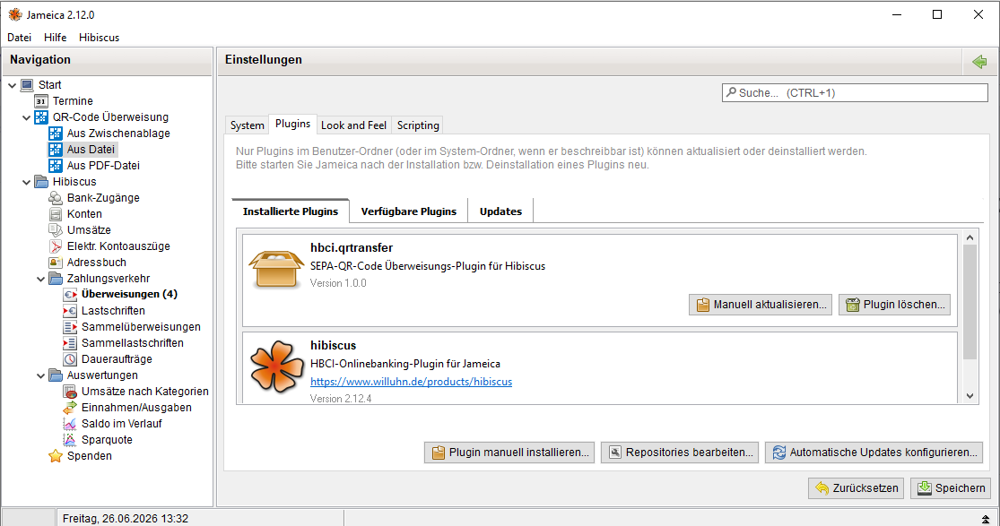
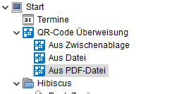
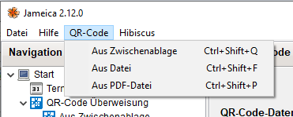
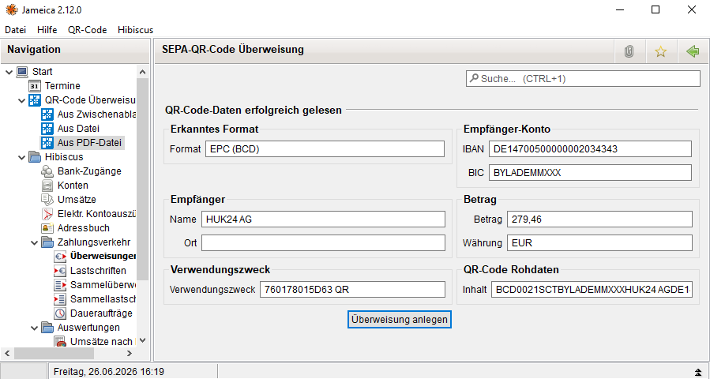

# SEPA QR-Transfer Plugin for Jameica/Hibiscus

A [Jameica](https://www.willuhn.de/products/jameica/) plugin that reads SEPA payment QR codes and creates transfer drafts in the [Hibiscus](https://www.willuhn.de/products/hibiscus/) online banking application.

## About This Project - AI Feasibility Study

This plugin is the result of a **feasibility study** to test the capabilities of current AI systems. The entire development - from the initial concept to the final upload on GitHub - was carried out entirely by AI. **The human author did not write a single line of code.**

From the first idea to the final implementation including the GitHub repository setup, **the entire project took only a few hours**. The first version was already functional - proving that AI can deliver working code quickly. However, **human testing was essential** to uncover issues that the AI could not anticipate, such as the webcam crashing Jameica and i18n translations silently failing due to Java Properties parsing quirks.

The project demonstrates that modern AI assistants can handle complex, multi-step software engineering tasks autonomously, including:
- Understanding domain-specific frameworks (Jameica/Hibiscus)
- Implementing multiple input methods (clipboard, file, PDF, webcam)
- Working with external libraries (ZXing, Apache PDFBox, JavaCV/OpenCV)
- Debugging and fixing integration issues
- Setting up build systems (Apache Ant)
- Implementing internationalization (i18n) with dynamic locale switching
- Managing Git repositories and publishing to GitHub

The result exceeded expectations and shows that AI can serve as a capable "co-developer" for real-world applications.

### Development Environment

- **AI Assistant:** [OpenCode](https://opencode.ai) using the `mimo/mimo-v2-free` model
- **Operating System:** Windows (development), Linux (testing)
- **Human Role:** Project owner and tester - provided requirements, tested the plugin in Jameica on Windows and Linux, reported bugs, and guided the development through natural language conversation
- **AI Role:** Full-stack developer - wrote all Java code, XML configuration, build scripts, managed dependencies, and handled Git/GitHub operations

## Features

- **Four input methods:**
  - **Clipboard** - Copy a QR code image and paste it directly
  - **Image file** - Open PNG, JPG, or BMP files containing a QR code
  - **PDF invoice** - Extract QR codes directly from PDF documents
  - **Webcam** - Scan QR codes in real-time using your webcam (JavaCV/OpenCV)

- **Supported QR code formats:**
  - **EPC (BCD)** - The standard European Payment Council format used on invoices
  - **EMV (TLV)** - The EMV standard format used in payment terminals

- **Automatic data extraction:**
  - IBAN and BIC
  - Recipient name and city
  - Amount and currency (EUR)
  - Payment reference / purpose

- **Seamless Hibiscus integration:**
  - Adds a "QR Code Transfer" submenu under Zahlungsverkehr in the navigation tree
  - Creates a pre-filled transfer draft ready for review and sending
  - Supports both domestic (German) and international SEPA transfers

- **Internationalization (i18n):**
  - Full English and German language support
  - Automatically switches based on Jameica locale settings
  - All UI text, error messages, and navigation items are translated

- **Navigation icons:**
  - Custom icons for each navigation entry (clipboard, image, PDF, webcam)

- **Platform support:**
  - Windows (tested)
  - Linux (tested)
  - macOS (not yet tested)

## Screenshots

### Plugin installed in Jameica


### Navigation tree with QR Code Transfer submenu


### QR Code menu with keyboard shortcuts


### Parsed SEPA data from QR code


## Installation

1. Download the latest release from the [Releases](https://github.com/istra711/QRtransfer/releases) page
   - Choose the correct ZIP for your platform: `windows`, `linux`, or `macos`
2. Open Jameica
3. Go to **Datei > Plugins online suchen... > Plugin manuell installieren...**
4. Select the downloaded ZIP file
5. Restart Jameica

### Manual Build

If you prefer to build from source:

```bash
# Requirements
# - JDK 17 or higher
# - Apache Ant

# Set JAVA_HOME (adjust path as needed)
export JAVA_HOME="/path/to/jdk"

# Build
ant dist

# The plugin will be in dist/hbci.qrtransfer/
```

## Usage

1. In Hibiscus, navigate to **Zahlungsverkehr > QR Code Transfer**
2. Choose one of the four input methods:
   - **Clipboard** - Reads QR code from clipboard
   - **Image File** - Opens a file dialog for image files
   - **PDF File** - Opens a file dialog for PDF invoices
   - **Webcam** - Opens webcam preview for real-time scanning
3. The plugin displays all extracted SEPA data
4. Click **Create Transfer** to create a transfer draft in Hibiscus
5. Review the data and send the transfer

### Keyboard Shortcuts

| Action | Shortcut |
|--------|----------|
| QR from clipboard | `Ctrl+Shift+Q` |
| QR from image file | `Ctrl+Shift+F` |
| QR from PDF | `Ctrl+Shift+P` |
| QR from webcam | `Ctrl+Shift+W` |

## Example EPC QR Code


```
BCD
001
1
SCT
BICXXXMH
Max Mustermann
DE89370400440532013000
EUR123.45
Rechnung Nr. 12345
```

## Technical Details

### Architecture

```
src/de/willuhn/jameica/hbci/qrtransfer/
├── QRTransferPlugin.java          # Plugin entry point
├── action/
│   ├── QRCodeAction.java          # Read QR from clipboard
│   ├── QRFileAction.java          # Read QR from image file
│   ├── QRPdfAction.java           # Read QR from PDF
│   └── QRWebcamAction.java        # Read QR from webcam (JavaCV/OpenCV)
├── gui/
│   ├── QRCodeView.java            # Preview and create transfer
│   └── WelcomeView.java           # Landing page with action buttons
├── model/
│   └── SepaData.java              # SEPA data model
└── parser/
    ├── QrCodeParser.java          # Parser interface
    ├── EpcParser.java             # EPC (BCD) format parser
    ├── EmvParser.java             # EMV (TLV) format parser
    └── ParserException.java       # Parser errors

src/lang/
├── hbci_qrtransfer_messages_en.properties      # English translations
└── hbci_qrtransfer_messages_de_DE.properties   # German translations
```

### Dependencies

- **[Jameica](https://www.willuhn.de/products/jameica/)** 2.0+ - Plugin framework
- **[Hibiscus](https://www.willuhn.de/products/hibiscus/)** 2.0+ - Online banking plugin
- **ZXing** 3.5.3 - QR code decoding library
- **Apache PDFBox** 3.0.3 - PDF rendering (for PDF QR extraction)
- **JavaCV** 1.5.9 - Java wrapper for OpenCV (webcam access)
- **OpenCV** 4.7.0 - Computer vision library for webcam frame capture
- **SWT** - Standard Jameica GUI toolkit

### i18n Design

The plugin uses Jameica's built-in `I18N` system with simple ASCII property keys (no spaces in keys) to avoid Java Properties parsing issues. Navigation and menu items in `plugin.xml` use i18n keys that Jameica automatically resolves via `AbstractItemXml.getName()`.

## Version History

### v1.0.6
- Rewrote webcam to use VideoCapture instead of OpenCVFrameGrabber (better Linux V4L2 support)

### v1.0.5
- Added webcam device selection dialog for systems with multiple cameras

### v1.0.4
- Fixed crash: `setInstantPayment()` now uses reflection for compatibility with Hibiscus 2.10.4 and earlier

### v1.0.3
- Cross-platform support: separate ZIP files for Windows, Linux, and macOS

### v1.0.2
- Fixed i18n: replaced German-text keys with simple ASCII keys (spaces in `.properties` keys caused silent parsing failures)
- Added full i18n support for navigation menu and top menu items
- Navigation and menu text now dynamically switches between English and German based on Jameica locale
- Updated dependencies: replaced `webcam-capture` with JavaCV/OpenCV for webcam support
- Added custom navigation icons (clipboard, image, PDF, webcam)

### v1.0.1
- Added webcam QR code scanning via JavaCV/OpenCV
- Added navigation icons
- Added keyboard shortcuts
- **Known issue:** Activating the webcam may crash Jameica

### v1.0.0
- Initial release with clipboard, file, and PDF input methods
- EPC (BCD) and EMV (TLV) parser support
- Hibiscus transfer draft creation

## License

This project is licensed under the GPL License - see the [LICENSE](LICENSE) file for details.

## Contributing

Contributions are welcome! Please open an issue or pull request on GitHub.
